# Information Architecture

## 1. Navigation shell

Every screen shares the same shell: a fixed **240px left sidebar** and a fluid **content area** to its right (1200px on the 1440px desktop canvas).

**Sidebar, top to bottom:**
1. **Logo block** — mark + "FYNROX" wordmark + "SUPER ADMIN" subtitle.
2. **Primary nav rail** — one entry per top-level module (icon + label): Dashboard, Users, Professionals, Relationships, Programs, Commerce, Growth, Analytics, (AI Operations — see note below), Support.
3. Either a **"System & Operations" flyout** (a chevron-triggered secondary menu, collapsed by default, holding Content, Notifications, Admin Users, Roles & Permissions, Audit Logs, Settings) **or** a **"SYSTEM STATUS" pill** ("All nodes online") — the two later screens (Finance, AI Operations) use the status pill instead of the flyout; see the note on inconsistency below.

**Top bar, present on almost every screen:**
- Page title + a live "last updated" timestamp / system-status line.
- Global search (placeholder text changes per module, e.g. "Search professional registry, certs…").
- Region/country selector ("🇺🇳 ALL REGIONS" with a dropdown chevron).
- Notification bell.
- Admin identity block: avatar, name, role badge (e.g. "ROOT ADMIN"), and an "Audit active/logging" status pill.

## 2. Three levels of in-module navigation

The Figma file uses three different sub-navigation patterns depending on the module — this is a real inconsistency in the source design (see [09-open-questions-gaps.md](07-open-questions-gaps.md)) and should be reconciled into one pattern before implementation, but all three are documented here as designed:

1. **Top tabs on a single screen** — e.g. Professionals' "All Professionals / Pending Verification / Active / Rejected / Suspended / Credentials Expiring" tabs, or a User Profile's "Overview / Activity / Subscription / Payments / Relationships / Support History" tabs. Used when the module is one screen with filtered views of the same record type.
2. **A second sidebar column ("module sub-nav")** — e.g. Commerce's `module-subnav` (Subscriptions / Transactions / Payments / Refunds / Pricing & Coupons), Growth's (Influencers / Influencer Detail / Referrals / Campaigns & Attribution), Support's (Support Tickets / Escalations / Complaints / Safety & Abuse), Analytics' (User Analytics / Engagement / Fitness & Nutrition / Business Analytics / Geographic / Unit Economics), Programs' (Programs / Exercises / Recipes / Educational Content / Review & Approval), and the Admin group's (Admin Users / Roles & Permissions / Audit Logs / Privacy & Data Governance / Security / Integrations / Notifications / Platform Settings). Used for multi-screen modules with genuinely distinct pages.
3. **A dedicated second sidebar panel with its own header ("finance-sub-nav" / "AI Operations" sub-nav)** — Finance and AI Operations replace the primary rail's icon+label items with a plain-text list under a section heading, and drop the "System & Operations" flyout in favor of a "SYSTEM STATUS" pill. This reads as a later, evolving iteration of the sidebar pattern (see gap notes).

## 3. Full sitemap

```mermaid
flowchart LR
    Root["Super Admin Console"]

    Root --> M01["01 Dashboard"]
    Root --> M02["02 Users"]
    Root --> M03["03 Professionals"]
    Root --> M04["04 Relationships"]
    Root --> M05["05 Programs / Content"]
    Root --> M06["06 Commerce"]
    Root --> M07["07 Growth"]
    Root --> M08["08 Support & Safety"]
    Root --> M09["09 Analytics"]
    Root --> M10["10 Finance"]
    Root --> M11["11 AI Operations"]
    Root --> M12["12 Admin & System"]

    M01 --> M0101["Executive Dashboard"]

    M02 --> M0201["User Directory"]
    M02 --> M0202["User Profile (tabs: Overview / Activity / Subscription / Payments / Relationships / Support History)"]

    M03 --> M0301["Professional Directory (tabs: All / Pending / Active / Rejected / Suspended / Credentials Expiring)"]
    M03 --> M0302["Professional Profile (tabs: Overview / Clients / Sessions / Earnings / Reviews / Credentials)"]
    M03 --> M0303["Credential Verification Workflow"]

    M04 --> M0401["Relationship Directory"]
    M04 --> M0402["Relationship Detail"]
    M04 --> M0403["Change / Intervention Queue"]

    M05 --> M0501["Programs"]
    M05 --> M0502["Exercises"]
    M05 --> M0503["Recipes"]
    M05 --> M0504["Educational Content"]
    M05 --> M0505["Review / Approval"]

    M06 --> M0601["Subscriptions"]
    M06 --> M0602["Transactions"]
    M06 --> M0603["Payments"]
    M06 --> M0604["Refunds"]
    M06 --> M0605["Pricing / Coupons"]

    M07 --> M0701["Influencers"]
    M07 --> M0702["Influencer Detail"]
    M07 --> M0703["Referrals"]
    M07 --> M0704["Campaigns & Attribution"]

    M08 --> M0801["Support Tickets"]
    M08 --> M0802["Escalations"]
    M08 --> M0803["Complaints"]
    M08 --> M0804["Safety / Abuse Reports"]

    M09 --> M0901["User Analytics"]
    M09 --> M0902["Engagement"]
    M09 --> M0903["Fitness & Nutrition"]
    M09 --> M0904["Business Analytics"]
    M09 --> M0905["Geographic Analytics"]
    M09 --> M0906["Unit Economics / Cohorts"]

    M10 --> M1001["Finance Dashboard"]
    M10 --> M1002["Revenue"]
    M10 --> M1003["Expenses & Payouts"]
    M10 --> M1004["Invoices"]
    M10 --> M1005["Receivables & Payables"]
    M10 --> M1006["Coach Settlements"]
    M10 --> M1007["Influencer Payouts"]
    M10 --> M1008["Taxes & Compliance"]
    M10 --> M1009["Bank / Payment Accounts"]
    M10 --> M1010["Financial Reports"]

    M11 --> M1101["AI Features & Models"]
    M11 --> M1102["AI Usage & Metrics"]
    M11 --> M1103["AI Safety / Overrides"]

    M12 --> M1201["Admin Users"]
    M12 --> M1202["Roles & Permissions"]
    M12 --> M1203["Audit Logs"]
    M12 --> M1204["Privacy & Data Governance"]
    M12 --> M1205["Security"]
    M12 --> M1206["Integrations"]
    M12 --> M1207["Notifications"]
    M12 --> M1208["Platform Settings"]
```

54 leaf screens across 12 modules — see [03-screen-inventory.md](03-screen-inventory.md) for the full functional detail of each.

## 4. Cross-module links observed

- **Dashboard → everywhere.** The "Requires Attention" panel and "Marketplace Status" quick links on the Executive Dashboard point into Professionals (pending applications), Support (ticket queue), Commerce (failed payments, refund requests), and Professionals (expiring credentials).
- **User Profile ↔ Relationships.** A User Profile's "Assigned Professionals" card and "Relationships" tab connect to the Relationships module.
- **Professional Directory → Credential Verification.** The directory's "Pending Verification" tab and the dedicated Credential Verification screen operate on the same underlying queue.
- **Growth → Influencer Detail.** Influencer Directory rows open into a dedicated Influencer Detail screen.
- **Support → Complaints detail drawer.** Complaints uses a list + right-hand "dossier" detail panel pattern rather than a separate screen.

## 5. Navigation-item vs. built-screen mismatches

The Finance sub-nav lists **12** destinations (Dashboard, Revenue, Expenses, Invoices, Bills & Vendors, Receivables & Payables, Coach Settlements, Influencer Payouts, Refunds & Adjustments, Taxes, Bank/Payment Accounts, Reports) but only **10** numbered Finance screens (10.01–10.10) exist — "Bills & Vendors" and "Refunds & Adjustments" are linked from the sidebar but have no corresponding frame. Flagged in [09-open-questions-gaps.md](07-open-questions-gaps.md).
