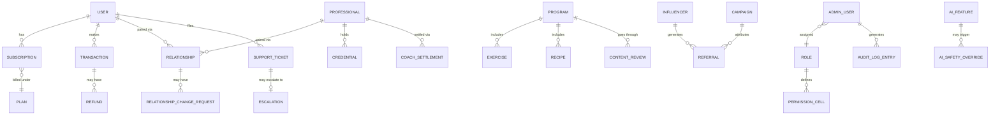

# Inferred Data Model

This is **not** a database schema — it's a reverse-engineered entity map built from the fields, table columns, and detail panels visible across the 54 screens, meant to give backend/API planning a starting point. Field names are illustrative; confirm real names, types, and constraints with backend/product before treating this as a contract. Anything not directly visible on a screen is not included here.

## 1. Core entity relationships

## 2. Entity notes (grouped by module)

**Identity & directory**
- `User` — end user account: email/account ID, phone, region, status, membership tier, acquisition channel, referral code, registration date, LTV rollups. **21 Aug 2026: admin-side Directory + Profile are now real** (Module 02 — Users, `apps/api/src/modules/adminUsers`) — email/account ID/phone/referral code/registration date are real `User` fields; membership tier and acquisition channel are real *derived* values (latest live `Subscription`'s plan tier, and whether a `Referral` row exists for this user), not stored columns; LTV rollups are real too, computed on read from `Payment` rather than stored. Region and status (active/suspended) are still NOT modeled — `User` has no country/region column and no account-status enum at all, unlike `Professional`/`AdminUser`. **26 Aug 2026: region is real now** — `User.countryCode` (ISO 3166-1 alpha-2), captured as an explicit choice on the mobile app's Edit Profile screen, not inferred from `phone` (optional, unvalidated, not collected at signup) — see `adminAnalytics.service.ts`'s Geographic doc comment. **25 Aug 2026:** this module is no longer fully read-only — a new `SensitiveDataAccessRequest` entity (requester/reviewer `AdminUser` relations, `reason`, `pending`/`approved`/`denied` status) backs a real supervisor-approved, logged request workflow for the Figma's locked "Sensitive Health Metrics" panel, gating real `OnboardingProfile` fields (medicalConditions/injuries/allergens/gender/age/weightKg/heightCm) per admin per user — see `adminUsers.service.ts`'s doc comment. **26 Aug 2026, later pass: status is real now too** — `User` gained a `status` (`active`/`suspended`) and `adminNotes` field, same shape as `Professional.status`/`AdminUser.status`, backing a real Module 02.01 bulk-select + suspend/reactivate. Re-investigated directly against the schema rather than trusting this line's own prior "no account-status enum at all" framing, and found it didn't need a new product decision — it's account-operations (blocks login), not the trust-and-safety moderation concept `SafetyReport` below still needs (no ban/appeal/reason-code). The auto-renew toggle remains genuinely unbuilt (no `Subscription.autoRenew`/renewal engine).
- `Professional` — coach/nutritionist: region, services (fitness/nutrition), languages, experience, rating, active-client count, earnings, verification status. **Real as of 20 Aug 2026** — see `apps/api/prisma/schema.prisma`'s `Professional` model (a third separate identity, alongside `User` and `AdminUser`, with its own auth/JWT — see `apps/api/src/modules/professionalAuth`). Rating/earnings/region are NOT modeled yet — no Review or Payout entity exists; only identity, services, verification status, and credentials are real. **21 Aug 2026:** gained an `adminNotes` field (single current-notes field, not a threaded log — the full audit trail is `AuditLog` via `recordAudit()`) for the new Credential Verification screen; `status` (`active`/`suspended`) can now genuinely be changed by an admin via `apps/api/src/modules/adminProfessionals` (suspend/reactivate), where before it only ever took its default value.
- `Credential` — one per professional per service type: qualification, issuing body, certificate number, issue/expiry dates, document reference, review status, reviewer notes. **Confirmed and made real 20 Aug 2026** as `ProfessionalCredential`, per [../coach/05-data-model.md](../coach/05-data-model.md) §2's correction: one row per **(professional, service type)** pair (not one per professional), plus a separate shared KYC document/status on `Professional` itself. No expiry-date field yet (the reviewed screens didn't show one for the coach app's own credential upload) — "Credentials Expiring" (03.01's tab) isn't computable until one is added; the tab exists in the API response and always returns empty. **21 Aug 2026: admin-side review is now real** (Credential Verification, 03.03, `apps/api/src/modules/adminProfessionals`) — `verifyCredential`/`verifyKyc` can move a credential or the shared KYC check from `pending` to `verified`/`rejected`, each recorded via `recordAudit()`; also gained its own `adminNotes` field, same single-current-notes convention as `Professional.adminNotes`. Before this, every real submission from `apps/coach-mobile`'s onboarding was permanently stuck at `pending`.

**Matching**
- `Relationship` — a User↔Professional pairing: service type, status, start date, pricing, session count, payment history. **Made real 20 Aug 2026** (`apps/api/prisma/schema.prisma`'s `Relationship` model) as the parent object per [../coach/05-data-model.md](../coach/05-data-model.md) §3's recommendation — pricing/session-count/payment-history are NOT modeled yet, since those depend on the `Booking` entity, which is intentionally not built this pass (see [../coach/07-open-questions-gaps.md](../coach/07-open-questions-gaps.md)'s "Phase 5 started" entry — the actual discovery/booking flow that would create a `Relationship` is still an open product decision, so no code path creates one yet; the table exists and is queried by `apps/admin-web`'s Executive Dashboard, but will read as empty until that flow exists). **21 Aug 2026: admin-side management is now real** (Module 04 — Relationships, `apps/api/src/modules/adminRelationships`) — a real filtered Directory, a Detail view, and the first code anywhere in the build that can end (or reactivate) a pairing (`endRelationship`/`reactivateRelationship`), recorded via `recordAudit()`. Still reads empty in practice until the discovery/booking flow above creates its first row.
- `RelationshipChangeRequest` — a requested reassignment: current vs. requested professional, reason, submitted date, approval status. **25 Aug 2026: real, end to end.** The entity + submission path shipped as part of Discovery & Booking (`POST /coaching/relationships/:id/change-request`, apps/user-mobile's Change Professional screen) — reason and an optional note are captured, current professional and submitted date are read off the existing `Relationship`/`createdAt`. The same day, the admin review screen (04.03 Change/Intervention Queue, `apps/api/src/modules/adminRelationships`) shipped too, closing the "deliberate gap" this bullet used to describe — the model gained `reviewedByAdmin`/`reviewedAt`/`reviewNotes` fields, and approval status now really moves `pending` → `approved`/`rejected`. One field the Figma spec implies but this build never captures: **"requested (new) professional"** — nothing anywhere records which replacement a user had in mind, so approving can't literally reassign; it ends the flagged pairing instead (the one well-defined effect available) and the user re-books through Discovery — see `adminRelationships.service.ts`'s doc comment for the full reasoning.

**Content**
- `Program`, `Exercise`, `Recipe`, `EducationalContent` — each with its own metadata (see [03-screen-inventory.md](03-screen-inventory.md) for exact fields per type) plus a `status` (draft/pending/approved/rejected) and `creator`/`author` reference. **22 Aug 2026: `Program`/`Exercise`/`Recipe` management is now real** (Module 05 — Programs CMS, `apps/api/src/modules/adminPrograms`) — the first code anywhere in this build that can create or edit any of these three (before this, `scripts/seed.ts` was the only way any row existed). `status` is real too, but as a deliberately simpler `ContentStatus` enum (`draft`/`published`) rather than the Figma's 4-state draft/pending/approved/rejected pipeline — see `prisma/schema.prisma`'s `ContentStatus` doc comment for why the fuller pipeline needs infrastructure this pass doesn't build. `creator` is real (`createdByAdminId`, null for pre-CMS/seeded rows). **`EducationalContent` remains entirely unmodeled** — no table, no producer or consumer flow anywhere in the build — deliberately excluded from this pass (05.04), same "empty by construction" reasoning as `RelationshipChangeRequest` above.
- `ContentReview` — a moderation record referencing any of the above (polymorphic): reviewer, priority, SLA due date, status. **25 Aug 2026: real, for Program/Exercise/Recipe.** Module 05.05 shipped the same day RBAC enforcement closed the "only super_admin is enforced" half of gap §7 that used to block this — the remaining "role split" reasoning turned out not to be the real blocker (no role in `PERMISSION_MATRIX` separates reviewer from creator anyway; a self-review guard at the individual-admin level, same precedent as `SensitiveDataAccessRequest`, makes review real without one). `contentType`/`contentId` are polymorphic (unenforced, same precedent as `AuditLog.entityType`/`entityId`) but cover only `program`/`exercise`/`recipe` — **not** Educational Content, which still doesn't exist as an entity to reference. `priority` and `sla` remain unmodeled (no due-date/urgency concept anywhere), surfaced honestly via `notAvailable` rather than faked. See `adminPrograms.service.ts`'s doc comment for the full reasoning.

**Commerce**
- `Plan` — subscription plan/pricing tier. Modeled as `SubscriptionPlan` since Phase 3 (tier, name, priceCents, billingCycle). **25 Aug 2026: admin-managed for real** (Module 06.05 — Pricing, Plans half only, `apps/api/src/modules/adminPlans`) — the first code anywhere in this build that can create, edit, or archive a plan row. Gained `isActive`/`createdAt`/`updatedAt` in the same pass; `isActive` is a reversible archive, not a delete (deleting a plan referenced by real `Subscription`/`Payment` rows would break historical data) — an archived plan is filtered out of the mobile-facing `listPlans()` but existing subscribers on it are untouched. Coupons remains unmodeled, see below.
- `Coupon` — discount code with usage rules. Still entirely unmodeled — no discount-code field anywhere in the checkout flow (`apps/api/src/modules/payments`) to apply one against. Blocks both 06.01's "Discounts" waterfall stage and 06.05 Pricing's Coupons half (the Plans half is real as of 25 Aug 2026, see `Plan` above).
- `Subscription` — a user's active plan: billing cycle, next renewal, amount due, auto-renew flag. Real since Phase 3; no `amount due`/`auto-renew flag` columns exist (renewal is simulated by `renewsAt`, not a real billing-cycle engine).
- `Transaction` — a payment event: amount, gateway, status, related entities, timestamp. Modeled as `Payment` since Phase 6's Razorpay integration (20 Aug 2026, gap §14/§38). **22 Aug 2026: Module 06 (06.02 Transactions + 06.03 Payments) is now a real console-wide admin surface over it** (`apps/api/src/modules/adminPayments`) — a filterable Payments directory plus a per-payment Transaction detail (the actual Plan/Program purchased, plus a real `AuditLog`-backed audit trail), both read-only, since `Payment.status` is entirely gateway/webhook-driven. Before this, the only admin-facing view was Module 02's User Profile, scoped to one user's own payments. See `adminPayments.service.ts`'s own doc comment for what's real vs. honestly not modeled, including why 06.01/06.04/06.05 aren't built this pass.
- `Refund` — linked to a transaction, with reason/approver/status. Still entirely unmodeled — no cancel-with-refund flow exists anywhere (mobile or backend), so a refund queue (06.04) would have no real submission path. Same "empty by construction" reasoning as `EducationalContent` above (unlike `RelationshipChangeRequest`, which turned out to already exist once that gap was re-examined — see its own entry above).

**Growth**
- `Influencer` — partner profile: referral code, discount, click/registration/conversion counts, revenue, commission, retention, status.
- `Referral` — an individual referred signup, attributable to an influencer and/or a campaign. **Real since Phase 4** (`User.referralCode` + `Referral`, `apps/api/src/modules/referrals`) — but only `referrerId`/`refereeId`/`createdAt`, not an influencer or campaign attribution; neither `Influencer` nor `Campaign` below exists. **25 Aug 2026: the admin side is now real too** (Module 07.03 — Referrals, `apps/api/src/modules/adminReferrals`) — a filtered directory, Total/Unique stats, and a real Top Referrers leaderboard. No click-tracking exists (a bad code is silently ignored, no row written), so the Figma's funnel visualization isn't built — at most one stage would ever be measurable. No reward/bonus field exists for either party either, so referral economics aren't built.
- `Campaign` — a marketing campaign with an attribution model and funnel metrics.

**Support & safety**
- `SupportTicket` — subject, category, priority, status, assignee, message thread. Real since Phase 4 (`docs/mobile/03-screen-inventory.md` §L), mobile-writable subset only until now (create + list-your-own, always starting and staying `open` — see the model's own doc comment in `prisma/schema.prisma`). **22 Aug 2026: Module 08 (08.01 Support Tickets) is now a real admin surface over it** (`apps/api/src/modules/adminSupport`) — a filterable directory with real Open/In-Progress/Resolved/Closed stats, plus the console's first real re-triage action against status/priority/category (audited, any-direction transitions allowed). `assignee` and the spec'd `message thread` are still not real: no assignment field exists on the model, and only the ticket's one original `message` exists — no `SupportMessage`/reply table backs a multi-message conversation. See `adminSupport.service.ts`'s own doc comment for the full reasoning, including why this module was picked over Module 07 — Growth this cycle.
- `Escalation` — an escalated ticket with escalation reason/status. **25 Aug 2026: real** (Module 08.02, `apps/api/src/modules/adminSupport`) — a direct, non-polymorphic FK to `SupportTicket` (escalatedBy/reason/status/resolvedBy/resolutionNotes/resolvedAt), raised via a new "Escalate" action on the Support Tickets detail panel and read back by a new Escalations queue. Turned out to be a resolvable annotation-on-an-existing-entity gap, not a genuine blocker like `Complaint`/`SafetyReport` below — see `adminSupport.service.ts`'s own doc comment for the full reasoning, including why there's no self-resolution guard and no "reopen".
- `Complaint` — a formal complaint record with a "dossier" of facts and a resolution. Still entirely unmodeled — no complaint-filing flow exists anywhere in either mobile app, and no existing action a "resolution" could safely reuse. Blocks 08.03.
- `SafetyReport` — a trust & safety report with severity/category/status. Still entirely unmodeled — no abuse-report flow exists anywhere. **26 Aug 2026:** `User` gained a `status` field (`active`/`suspended`), but that's account-operations for Module 02.01 (login on/off, no reason code, no appeal), not a moderation/trust-and-safety concept — a real ban/appeal/severity taxonomy for 08.04 is still a genuinely separate, open decision this doesn't resolve. Blocks 08.04.

**Finance**
- **26 Aug 2026: gap §4 resolved — one ledger.** Finance reads the same `Payment`/`Subscription` data Commerce owns rather than a separate `FinanceLedgerEntry` abstraction — see [07-open-questions-gaps.md](07-open-questions-gaps.md)'s "26 Aug 2026" entry and [reports/finance-architecture-plan.html](../../reports/finance-architecture-plan.html) for the full decision record. The bullets below replace this section's pre-decision guesses with what's actually real.
- `Expense` — a real, admin-entered business cost (category/description/amountCents/status/incurredAt) backing 10.03's Expenses half, 10.01's Expenses-MTD KPI, and 10.05's Payables view. **Real as of 26 Aug 2026** (`apps/api/src/modules/adminFinance`) — category taxonomy lifted directly from 10.03's own spec'd expense-waterfall categories, not invented.
- `Invoice` — one real row per `Payment` that reaches `paid`, generated automatically from `payments.service.ts`'s `activatePayment()`, backing 10.04. **Real as of 26 Aug 2026.** No manual invoice-creation flow — this is a consumer subscription app, not a B2B biller.
- `TaxConfig` — an admin-entered jurisdiction + rate, backing 10.08. **Real as of 26 Aug 2026**, deliberately reframed from an automated tax-rule engine to a real settings screen — this build encodes no actual tax law, the admin configures their own.
- `CoachSettlement` / `InfluencerPayout` — periodic payout records with breakdown line items and Hold/Approve status. **Still entirely unmodeled** — blocked on a commission/take-rate decision this build has never made (shared with Module 07 and 09.04 Business Analytics), and even once decided there's no real coaching-payment data to settle against (`Relationship` carries no pricing — see §3 above). Blocks 10.06/10.07.
- `BankAccount` — connected payment/bank account with balance and sync status. **Still entirely unmodeled** — the spec's own "sync"/"refresh" language implies live bank connectivity a stored record can't honestly provide; needs a real banking-aggregation vendor account, not a schema. Blocks 10.09.

**AI Operations**
- `AIFeature` — a named model/capability: model + version, status (active/beta/disabled), rollout %, latency, error rate, target countries. Still entirely unmodeled as this multi-row shape — this build has exactly one real AI capability (AI Coach chat), so a table of named capabilities would need at least 3 fabricated rows to match the Figma spec. **27 Aug 2026: the one-capability case is real, differently shaped** — `AiCoachSettings` (a single singleton row, `isEnabled`/`updatedByAdminId`/`updatedAt`) backs a real on/off switch for AI Coach chat, enforced in `aiCoach.service.ts`'s `sendMessage()`. Re-investigated directly against `reports/build-plan.html`'s own 11.01–11.03 text rather than trusting its "needs your decision" framing at face value — the doc's own next-step language had already named this exact smaller slice as buildable without a new product decision. Rollout %/latency/error-rate/target-countries remain unmodeled — no per-capability metrics beyond a reply count are tracked anywhere in this build.
- `AISafetyOverride` — a manual correction/override applied to an AI output, with the acting admin and details. Still entirely unmodeled — no moderation/override concept exists for AI Coach chat's replies. A genuinely separate, still-open decision from `SafetyReport` above (08.04) — user-generated-content moderation and AI-output moderation are different problems, not the same gap counted twice.

**Platform administration**
- `AdminUser` — internal staff account: name, email, assigned role, status, last login. **Real as of 20 Aug 2026** — see `apps/api/prisma/schema.prisma`'s `AdminUser` model (a genuinely separate table/identity from the consumer `User`, own JWT secret) and `apps/api/src/modules/adminAuth`. **22 Aug 2026: management is now real too** (Module 12.01 — Admin Users, `apps/api/src/modules/adminAccounts`) — the first code anywhere in this build that can create, disable, or enable an `AdminUser` row; before this, every row was seed-script-only. Creation server-generates a one-time temporary password (the Figma's "Invite" relabeled "Create Admin User", since no email/SMTP infrastructure exists in this build) rather than accepting one from the client. A self-disable guard (400 `cannot_disable_self`) prevents an admin from locking themselves out. **25 Aug 2026: all 8 roles are enforced, not just `super_admin`** (`apps/api/src/middleware/adminPermissions.ts`) — creating/disabling/enabling an `AdminUser` row now itself requires the `admin` module's `create`/`edit` grant, which today only `super_admin` holds (gap §7 in [07-open-questions-gaps.md](07-open-questions-gaps.md) is enforcement-closed; the other 7 roles' matrices remain a derived starter set pending product confirmation, not "unbuilt").
- `Role` — name, description, and a `PermissionCell` matrix (module × action → granted boolean) — see [05-roles-permissions.md](05-roles-permissions.md).
- `AuditLogEntry` — actor, action, entity type/id, timestamp, metadata; immutable (the Audit Logs screen shows a lock icon). Modeled as `AuditLog` since 19/20 Aug 2026 and written to throughout this build via `recordAudit()`; **21 Aug 2026:** Module 04's Relationship Detail (04.02) is the first screen anywhere in this build to actually read it back out for display — a per-relationship History tab, explicitly scoped and labeled as an admin-action trail rather than the dedicated Audit Logs screen. **Same day, Module 02's User Profile (02.02)** reads it a second way — queried by `actorId` rather than `entityType`/`entityId`, surfacing a given user's own recent actions (signup, login, password change, workout completions, payments, etc.) as its Overview's Recent Activity feed. **22 Aug 2026,** two more scoped reads joined these: Module 06's Transaction Detail (a per-payment audit trail) and Module 08's Support Ticket triage history (a per-ticket old→new diff trail). **Same day, Module 12.03 — Audit Logs is now real** (`apps/api/src/modules/adminAuditLogs`) — the full, unscoped, filterable view these four scoped reads all anticipated: real actorType/search/date-range filters, a batched actor-name resolver across all three actor identities, Total/Admin/User/Professional stats, and a most-recent-200 cap with a real `totalCount` and `truncated` flag rather than either full pagination or a silent under-report. Read-only, matching the table's write-once-by-design nature; CSV export is a client-side rendering of the rows already loaded, not a new endpoint.
- `PrivacyRequest` (DSAR) — user data export/delete request with status.
- `Integration` — a connected third-party service with status and credential reference. Still entirely unmodeled as a table (no admin can add/remove a connection — that would need real OAuth/credential-storage infrastructure this build doesn't have). **25 Aug 2026: the admin-visible half is real without one** (Module 12.06 — Integrations, `apps/api/src/modules/adminIntegrations`) — this build only ever wires up exactly two external services in code (Razorpay, the AI provider), so `GET /admin/integrations` reports their real status directly from the two status helpers each already had (`isRazorpayConfigured()`, `getAiProviderStatus()`) rather than reading rows from a table. Same "computed, no dedicated entity" shape as Analytics below — see that entry for the pattern.
- `NotificationTemplate` / `NotificationGateway` — messaging templates and the channels (email/SMS/push) they send through.
- `PlatformSetting` — key/value configuration, scoped by category (General, Security, Notifications, Integrations, Billing, API, Localization).

**Analytics (computed, no dedicated entity)**
- Module 09 Analytics doesn't introduce a table of its own — it's a read view computed on the fly over `User`, `Payment`, `Referral`, `WorkoutSession`, `MealLog`, `WaterLog`, `ExerciseSetLog`, and `BodyMeasurement`, all of which already existed for other reasons. **25 Aug 2026: 09.01 User Analytics is now real** (`apps/api/src/modules/adminAnalytics`) — the first module in this build needing zero new entities, confirmed by grepping `prisma/schema.prisma` for every entity name every other still-blocked module needs (none exist, and Analytics needs none either). Its KPI row (new/active users, revenue, referral signups) is a genuine period-over-period comparison — current vs. the immediately preceding period of equal length, `null` rather than a fabricated 0% when there's no prior-period baseline; "active" reuses `adminDashboard.service.ts`'s own `activeUsers30d` signal (≥1 `WorkoutSession`/`MealLog`/`BodyMeasurement` in-window) rather than inventing a second definition of activity. The Retention Cohort table is a second, independent computed view — 6 fixed calendar-month signup cohorts × months-since-signup offset 0–3, `null` (not `0`) for a not-yet-elapsed month, deliberately on its own fixed axis rather than the KPI row's adjustable date range. Recovery and Business (in-page tabs) have no backing data anywhere in this build and render `NotAvailablePanel` rather than a fabricated chart. **26 Aug 2026: AI, Geographic, and the "compare" toggle are real too** — AI aggregates the now-real `AiCoachMessage` table; Geographic is a live `User.countryCode` snapshot (country, user count, % of total, revenue), decoupled from the KPI date filter like Retention Cohorts, with a real "Unknown" bucket for anyone who hasn't set it; compare surfaces each KPI's already-computed previous-period value. 09.02 Engagement and 09.03 Fitness & Nutrition also shipped the same day as their own top-level screens. 09.05 Geographic Analytics is real but deliberately combined into 09.01's tab rather than a separate route — it would be an exact duplicate, same "no near-duplicate screens" precedent as Security/Subscription/Coach Discovery. **27 Aug 2026: 09.06 Unit Economics is real too** (`getUnitEconomics` in `adminAnalytics.service.ts`) — re-checking directly rather than trusting the "needs a CAC computation" framing above found that computation's one missing input, monthly marketing spend, had already shipped a day earlier as Finance's `Expense.category: "marketing"` (10.03). Reads `Expense`/`Payment`/`User` for New Users/Marketing Spend/CAC KPIs (CAC `null`, not a fabricated $0, when either side is zero), an all-time Average LTV, an LTV:CAC ratio, and a Cohort Economics table pairing each of 09.01's 6-month signup cohorts with that month's real spend/CAC — still zero new entities. 09.04 Business Analytics remains the one genuinely unbuilt tab — it needs a take-rate/commission decision this pass doesn't make.

## 3. Open modeling questions

- Is `Relationship` 1:1 (one active professional per user per service) or does a user have multiple simultaneous relationships (e.g., one fitness coach + one nutritionist)? The Fitness/Nutrition/Both service tagging throughout suggests the latter — confirm before designing the schema.
- Are `Program`, `Exercise`, `Recipe`, and `EducationalContent` genuinely separate tables, or variants of one polymorphic `ContentItem`? They share enough shape (status, author/creator, updated date, review workflow) that a shared base table with type-specific extension tables may fit better than four independent tables.
- ~~Is `Commerce` (Module 06) fully backed by the same ledger as `Finance` (Module 10), or are these two different systems...~~ **Resolved 26 Aug 2026 — one ledger.** See the Finance entity notes above and [07-open-questions-gaps.md](07-open-questions-gaps.md)'s "26 Aug 2026" entry for the full decision record.
