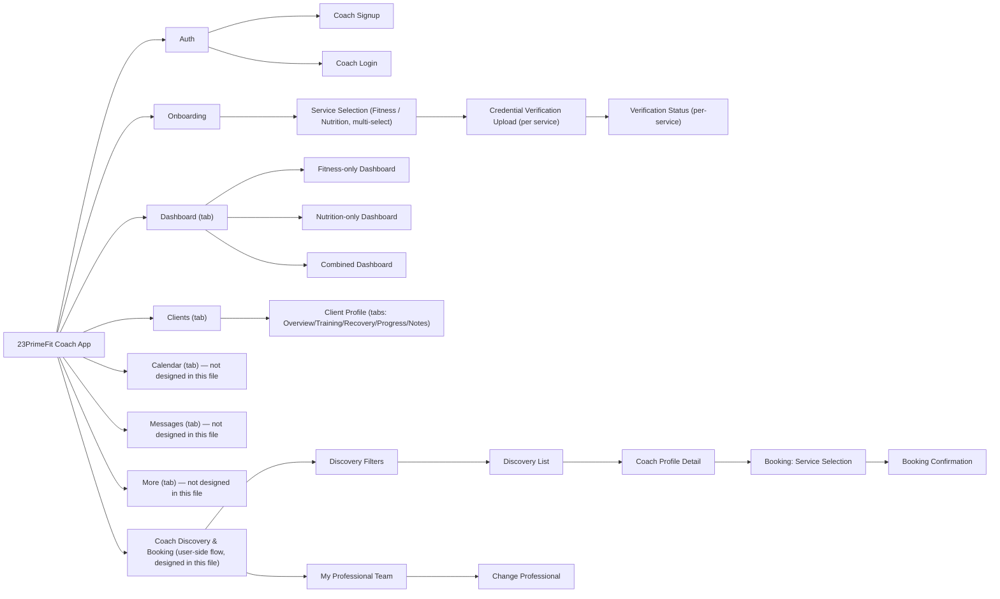

# Information Architecture — Coach App

## 1. Two distinct flows in one file

**Flow A — Coach onboarding & practice management** (`coach-`/`professional-` prefixed screens): signup/login → service selection → credential upload → verification status → dashboard → client profile. This is a linear onboarding funnel followed by a tab-based practice-management app.

**Flow B — Coach discovery & booking** (`user-` prefixed screens): filters → results list → coach profile → book a service/slot → confirmation, plus ongoing relationship management (my professional team, change professional). This is the *user's* side of finding and booking a coach, designed inside this file even though it's consumer-facing — see [01-product-requirements.md](01-product-requirements.md) §3 for why this is a problem to resolve, not just a filing quirk.

## 2. Coach-side navigation shell

Post-onboarding, a 5-tab bottom bar: **Dashboard, Clients, Calendar, Messages, More**. Only **Dashboard** (3 variants) and one **Clients** destination (a client profile screen) were actually designed; Calendar, Messages, and More have no frames in this file.

## 3. Full sitemap

16 leaf screens — full detail in [03-screen-inventory.md](03-screen-inventory.md).

## 4. Navigation inconsistency found

The "My Professional Team" screen (`user-my-professional-team`) renders a bottom tab bar labeled **Home, Explore, Sessions, Messages, Profile** — matching **neither** this app's own coach-side tab bar (Dashboard/Clients/Calendar/Messages/More) **nor** the consumer app's tab bar (Today/Train/Fuel/Recover/More, per [../mobile/02-information-architecture.md](../mobile/02-information-architecture.md)). Three different 5-tab label sets now exist across the two files for what should likely be one consistent shell (at least within the consumer app, since this screen is conceptually part of it). Flagged in detail in [07-open-questions-gaps.md](07-open-questions-gaps.md) §2.
