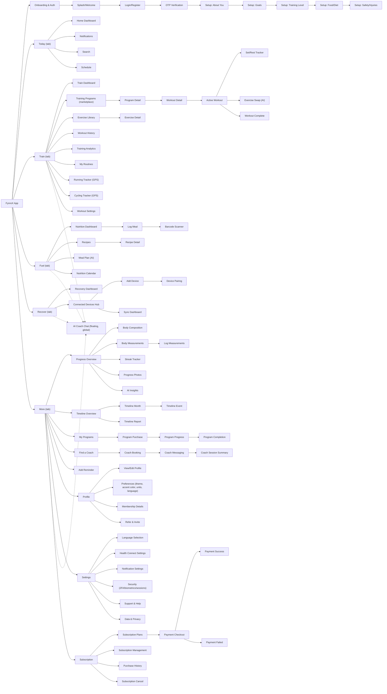

# Information Architecture — Mobile App

## 1. Navigation shell

**Onboarding** (splash → login/register → OTP → a 5-step setup wizard: About You → Goals → Training level → Food/diet → Safety/injuries, each with a progress bar and step label) is a linear flow with no bottom nav, ending on the Today home screen.

**Post-onboarding**, a persistent **5-tab bottom bar** appears on effectively every screen: **Today, Train, Fuel, Recover, More**. ("More" is itself a hub screen, not a 6th top-level module — see §3.) An **AI Coach floating action button** floats above the tab bar on most Train/Fuel/Recover/Progress screens, opening the AI chat from anywhere.

Most screens also share: an iOS status bar (time/signal/wifi/battery — a design artifact, not app UI), a back-button + title header on drill-in screens, and a home-indicator bar at the bottom (iOS gesture-nav convention).

## 2. The five tabs

1. **Today** — the home dashboard: AI daily brief, readiness score (sleep/HRV/stress ring), today's training card, nutrition snapshot, hydration tracker, and a recovery action card. Also reachable from Today: Notifications, Search, Schedule.
2. **Train** — the entire Training module (see §3), the largest single area of the app.
3. **Fuel** — Nutrition: dashboard, meal logging, barcode scanner, recipes, AI meal plan, nutrition calendar.
4. **Recover** — Recovery dashboard + the wearable device hub (add device, pairing, sync).
5. **More** — a catch-all menu surfacing: Progress & Body, Timeline, Programs, Coaching, Profile, Settings, Subscription, and Referral — i.e. everything that doesn't fit in the four primary daily-use tabs.

## 3. Full sitemap

82 leaf screens across 15 functional groups — full detail in [03-screen-inventory.md](03-screen-inventory.md).

## 4. Cross-links worth noting

- **Today → everything.** The home dashboard's cards (training, nutrition, hydration, recovery) deep-link into Train/Fuel/Recover directly, mirroring the Admin Dashboard's "quick link" pattern in the other app.
- **Active Workout → Exercise Swap / Set-Rest Tracker.** A workout in progress can branch into either an AI-assisted exercise swap or a focused rest-timer view without leaving the workout session.
- **Program Detail → Program Purchase → Program Progress → Program Completion** is a clean linear commerce+fulfillment funnel.
- **Find Coach → Coach Booking → Coach Messaging → Session Summary** mirrors the program funnel but for human coaching.
- **Profile → Membership Details / Subscription** and **Subscription Plans → Payment Checkout → Success/Failed** are the monetization backbone, independent of (but cross-linked from) Profile.
