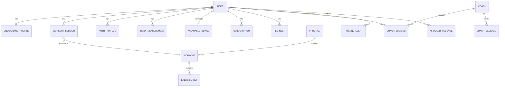

# Inferred Data Model — Mobile App

Same caveat as [../06-data-model.md](../admin/06-data-model.md): this is reverse-engineered from screen content, not an authoritative schema. Where an entity here clearly corresponds to one already listed for the admin console, that's called out — see [06-cross-app-integration.md](06-cross-app-integration.md) for the full mapping.

## 1. Core entities by area

## 2. Entity notes by module

**Identity & onboarding**
- `User` — account: name, phone (OTP-verified), recovery email, language preference, accent-color/theme preference, unit system (metric/imperial).
- `OnboardingProfile` — gender, age, weight, height, goals (multi-select), training level, diet type, allergens, medical conditions, injuries. This is health-adjacent data collected at signup and should be modeled with the same care as the admin console's "Sensitive Health Metrics" concept (see [06-cross-app-integration.md](06-cross-app-integration.md)).

**Training**
- `Program` — name, type, weekly structure, pricing (AI-only vs. AI+Coach), benefits list. Corresponds to the admin console's `Program` entity — these are almost certainly the *same* records, authored/moderated in the admin console and *sold/consumed* here.
- `Workout` — a structured session template: phases (warm-up/strength/cardio/cooldown), duration, intensity.
- `Exercise` — name, muscle group, equipment, difficulty, media (video). Corresponds to the admin console's `Exercise` entity.
- `WorkoutSession` — an actual logged instance of a workout: start/end time, mode (gym/home), logged sets (weight, reps, RPE), heart-rate data, completion status.
- `ExerciseSet` — one logged set within a session: weight, reps, RPE, warm-up/drop-set flags, rest duration.
- `Routine` — a user's saved/recurring workout template with a schedule and reminder toggle.
- `RunSession` / `CycleSession` — GPS-tracked cardio activity: route, pace/speed, splits, heart-rate zones, elevation (cycling), cadence/power (cycling).

**Nutrition**
- `Recipe` — corresponds to the admin console's `Recipe` entity (same content, authored centrally, consumed here).
- `MealLog` — a logged meal: food items, macros, timestamp, meal slot (breakfast/lunch/dinner), source (manual/barcode/photo/saved).
- `FoodItem` — a cataloged food/product (barcode-scannable), with macro data.
- `MealPlan` — an AI-generated 7-day plan, day-by-day meal assignments.
- `WaterLog` — daily water intake vs. a goal.

**Recovery & devices**
- `WearableDevice` — brand/model, connection status, battery, last-sync time, granted permission scopes (steps, heart rate, sleep, SpO2, stress, workout auto-detect).
- `RecoveryMetric` — daily recovery score, contributing sub-scores (sleep, HRV, resting HR, stress), derived from connected-device data.

**Progress & body**
- `BodyMeasurement` — weight and point measurements (chest/waist/arms/thighs, etc.) over time.
- `ProgressPhoto` — timestamped photo, used in before/after comparisons.
- `StreakRecord` — per-category (training/nutrition/mindfulness/hydration) consecutive-day streak.
- `PersonalRecord` — a best-ever value for a specific lift/metric (e.g. bench press 1RM), with a timestamp.
- `AIInsight` — a generated prediction or anomaly flag tied to a user's data (plateau warning, forecast, recovery recommendation).

**Timeline**
- `TimelineEvent` — a dated milestone (PR, goal reached, workout-count milestone), possibly annotated by a coach (`coach-comment` layer seen on the month view).

**AI Coach**
- `AICoachConversation` / `AICoachMessage` — chat history with the AI coach, topic-tagged (training/nutrition/recovery/form).

**Human coaching**
- `Coach` — corresponds to the admin console's `Professional` entity: name, specialty, rating, price per session, bio, availability.
- `CoachBooking` — a booked session: date/time, package/pricing tier, status.
- `CoachMessage` — a direct message between user and coach, including shared plan/video attachments.
- `CoachSession` — a completed session record with a summary and rating.

Note: `Coach`/`CoachBooking`/`CoachMessage` here almost certainly correspond to the admin console's `Relationship` entity (the user↔professional pairing) — see [06-cross-app-integration.md](06-cross-app-integration.md) for how these should reconcile into one shared model rather than two parallel ones.

**Monetization**
- `SubscriptionPlan` — tier (Basic/Pro/Elite), price, billing cycle, feature grants — corresponds to the admin console's `Plan` entity.
- `Subscription` — a user's active plan, renewal date, status. Corresponds to the admin console's `Subscription` entity — **this should be one shared table**, not duplicated between apps.
- `ProgramPurchase` — a one-off (or program-scoped) purchase, independent of subscription tier, with an AI-only vs. AI+Coach add-on choice.
- `Payment` / `Transaction` — corresponds directly to the admin console's `Transaction` entity.
- `Referral` — corresponds to the admin console's `Referral` entity (the growth/influencer module tracks referral performance in aggregate; this is the per-user-initiated version of it).

**Platform**
- `Reminder` — category, time, repeat schedule, alarm toggle.
- `NotificationPreference` — per-category push-notification toggles.
- `Device Session` — active login sessions shown in Security settings (phone/laptop/tablet) — implies multi-device/web access exists or is planned beyond just this mobile app.

## 3. Open modeling questions

- Is `Program` (and `Recipe`, `Exercise`) truly the same record surfaced in both apps, or does the mobile app consume a published/versioned copy? **Answered by the actual build (25 Aug 2026):** same record, no versioning — `ContentStatus` (draft/published) is a single field on the row itself, and admin "Review/Approval" (05.05, real as of 25 Aug 2026) gates it in real time: Approve calls the same publish function the direct Publish button does, flipping that field immediately, not on a batch/scheduled publish cycle. See `adminPrograms.service.ts`'s doc comment.
- Is a `CoachBooking` here the same underlying object as a `Relationship` in the admin console, or a separate "session" concept layered on top of an existing relationship? The admin's Relationship Directory shows ongoing pairings with session/payment counts, while this app's booking flow looks more like discrete, bookable sessions — these may need to compose (a `Relationship` containing many `CoachBooking`s) rather than being two disconnected models.
- Does a `ProgramPurchase` grant access independent of `Subscription` tier, or is program access itself gated by tier (e.g. can a Basic/free user buy a one-off program)? See [01-product-requirements.md](01-product-requirements.md) §5.
